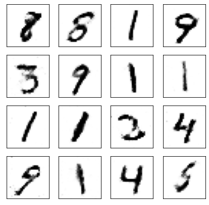
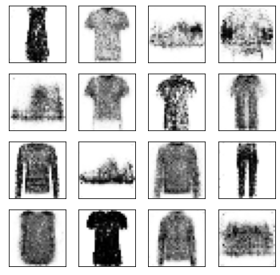

# Generative Adversarial Networks

Pytorch implementation of GAN(Generative Adversarial Networks) on the MNIST and FashionMNIST dataset

## Dependencies

- PyTorch
- Torchvision
- Numpy

## Results

### 1. MNIST

| After 100 epochs | After 200 epochs |
|:--------:|:--------:|
|  |  |
|  |  |

### 2. FashionMNIST

| After 100 epochs | After 200 epochs |
|:--------:|:--------:|
|  |  |
|  |  |

## Reference

1. "Generative Adversarial Networks": https://arxiv.org/pdf/1406.2661.pdf
2. Tutorial for coding: https://github.com/udacity/deep-learning-v2-pytorch/tree/master/gan-mnist
